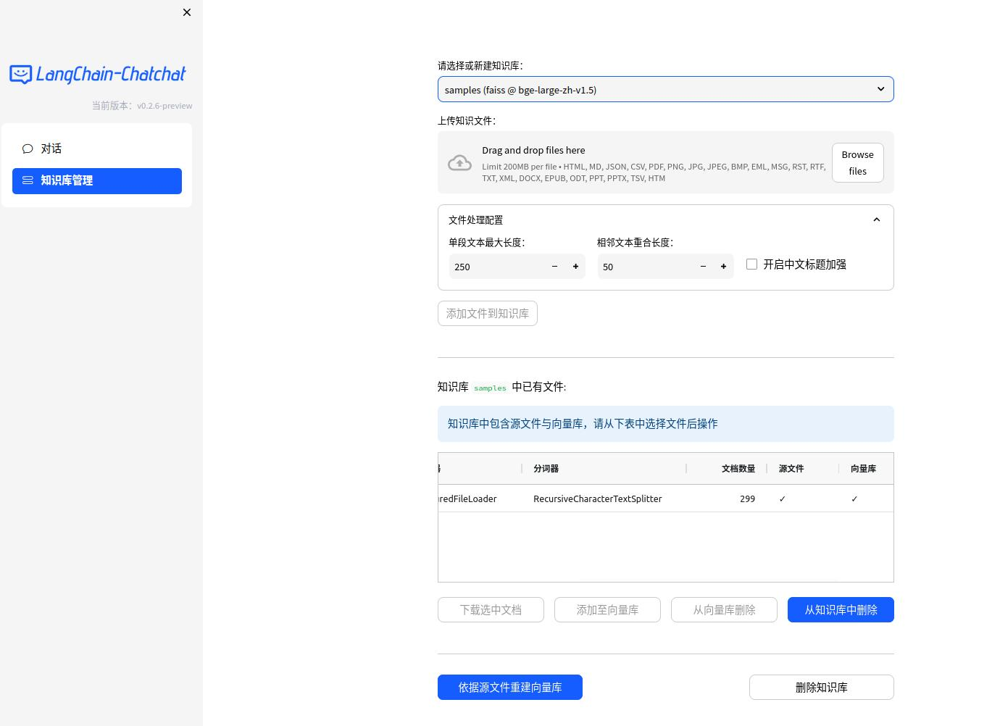

# Langchain-Chatchat-TPU <!-- omit in toc -->


适配 Sophon BM1684X，集成 [FastChat](https://github.com/lm-sys/FastChat/tree/main) 框架

原始仓库为[Langchain-Chatchat](https://github.com/chatchat-space/Langchain-Chatchat/tree/master)

## 目录 <!-- omit in toc -->
- [介绍](#介绍)
- [解决的痛点](#解决的痛点)
- [快速上手](#快速上手)
  - [1. 环境配置](#1-环境配置)
  - [2， 模型下载](#2-模型下载)
  - [3. 初始化知识库和配置文件](#3-初始化知识库和配置文件)
  - [4. 一键启动](#4-一键启动)
  - [5. 启动界面示例](#5-启动界面示例)

## 介绍

🤖️ 一种利用 [langchain](https://github.com/langchain-ai/langchain)
思想实现的基于本地知识库的问答应用，目标期望建立一套对中文场景与开源模型支持友好、可离线运行的知识库问答解决方案。

💡 受 [GanymedeNil](https://github.com/GanymedeNil) 的项目 [document.ai](https://github.com/GanymedeNil/document.ai)
和 [AlexZhangji](https://github.com/AlexZhangji)
创建的 [ChatGLM-6B Pull Request](https://github.com/THUDM/ChatGLM-6B/pull/216)
启发，建立了全流程可使用开源模型实现的本地知识库问答应用。本项目的最新版本中通过使用 [FastChat](https://github.com/lm-sys/FastChat)
接入 Vicuna, Alpaca, LLaMA, Koala, RWKV 等模型，依托于 [langchain](https://github.com/langchain-ai/langchain)
框架支持通过基于 [FastAPI](https://github.com/tiangolo/fastapi) 提供的 API
调用服务，或使用基于 [Streamlit](https://github.com/streamlit/streamlit) 的 WebUI 进行操作。

✅ 依托于本项目支持的开源 LLM 与 Embedding 模型，本项目可实现全部使用**开源**模型**离线私有部署**。与此同时，本项目也支持
OpenAI GPT API 的调用，并将在后续持续扩充对各类模型及模型 API 的接入。

⛓️ 本项目实现原理如下图所示，过程包括加载文件 -> 读取文本 -> 文本分割 -> 文本向量化 -> 问句向量化 ->
在文本向量中匹配出与问句向量最相似的 `top k`个 -> 匹配出的文本作为上下文和问题一起添加到 `prompt`中 -> 提交给 `LLM`生成回答。

📺 [原理介绍视频](https://www.bilibili.com/video/BV13M4y1e7cN/?share_source=copy_web&vd_source=e6c5aafe684f30fbe41925d61ca6d514)


从文档处理角度来看，实现流程如下：


🧩 本项目有一个非常完整的[Wiki](https://github.com/chatchat-space/Langchain-Chatchat/wiki/) ， README只是一个简单的介绍，_
_仅仅是入门教程，能够基础运行__。
如果你想要更深入的了解本项目，或者想对本项目做出贡献。请移步 [Wiki](https://github.com/chatchat-space/Langchain-Chatchat/wiki/)
界面

## 解决的痛点

该项目是一个可以实现 __完全本地化__推理的知识库增强方案, 重点解决数据安全保护，私域化部署的企业痛点。
本开源方案采用```Apache License```，可以免费商用，无需付费。

我们支持市面上主流的本地大语言模型和Embedding模型，支持开源的本地向量数据库。
支持列表详见[Wiki](https://github.com/chatchat-space/Langchain-Chatchat/wiki/)

## 快速上手

### 1. 环境配置

+ 首先，确保你的机器安装了 Python 3.8 - 3.11 (我们强烈推荐使用 Python3.11)。

```bash
$ python --version
Python 3.10.14
```

接着，创建一个虚拟环境，并在虚拟环境内安装项目的依赖

```shell

# 拉取仓库
$ git clone https://github.com/wangyifan2018/LangChain-Chatchat-TPU.git

# 进入目录
$ cd LangChain-Chatchat-TPU

# 安装tpu版本的FastChat
$ git submodule update --init --recursive
$ cd FastChat-TPU
$ pip install --upgrade pip  # enable PEP 660 support
$ pip install -e ".[model_worker]"
$ cd ..

# 安装全部依赖
$ pip install -r requirements.txt
$ pip install -r requirements_api.txt
$ pip install -r requirements_webui.txt

# 默认依赖包括基本运行环境（FAISS向量库）。如果要使用 milvus/pg_vector 等向量库，请将 requirements.txt 中相应依赖取消注释再安装。
```

请注意，LangChain-Chatchat `0.2.x` 系列是针对 Langchain `0.0.x` 系列版本的，如果你使用的是 Langchain `0.1.x`
系列版本，需要降级您的`Langchain`版本。

安装 SAIL，参考[Sail_Install_Guide](./docs/Sail_Install_Guide.md)

### 2， 模型下载
以本项目中默认使用的 LLM 模型 [THUDM/ChatGLM3-6B](https://huggingface.co/THUDM/chatglm3-6b) 与 Embedding
模型 [shibing624/text2vec-bge-large-chinese](https://huggingface.co/shibing624/text2vec-bge-large-chinese) 为例：

```Shell
$ pip install dfss -i https://pypi.tuna.tsinghua.edu.cn/simple --upgrade
$ python -m dfss --url=open@sophgo.com:ezoo/chatdoc/bmodel.tar.gz
$ tar -zxvf bmodel.tar.gz
```
下载的文件包括
```
bmodel
├── chatglm3-6b
│   ├── chatglm3-6b_int4_1dev_2k.bmodel
│   ├── tokenization_chatglm.py
│   ├── tokenizer_config.json
│   └── tokenizer.model
├── qwen-7b-chat
│   ├── qwen-7b_int4_1dev_2k.bmodel
│   ├── qwen.tiktoken
│   ├── tokenization_qwen.py
│   └── tokenizer_config.json
└── text2vec-bge-large-chinese
    ├── bge_large_512_fp16_4b.bmodel
    ├── special_tokens_map.json
    ├── tokenizer_config.json
    └── vocab.txt
```

### 3. 初始化知识库和配置文件

按照下列方式初始化自己的知识库和简单的复制配置文件

```shell
$ python copy_config_example.py
$ python init_database.py --recreate-vs
 ```

### 4. 一键启动

按照以下命令启动项目

```shell
$ python startup.py -a
```

### 5. 启动界面示例

如果正常启动，你将能看到以下界面

1. FastAPI Docs 界面


2. Web UI 启动界面示例：

- Web UI 对话界面：


- Web UI 知识库管理页面：




---
